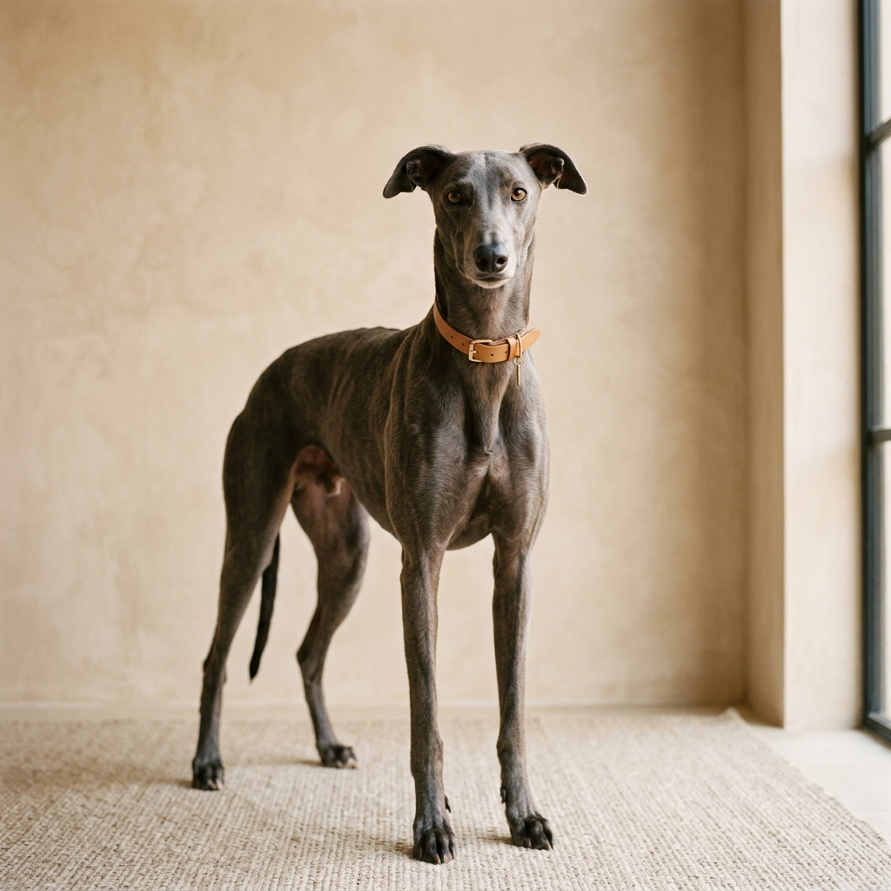

# Pethaus — Estúdio de Bem-Estar Pet



Uma landing page premium, sofisticada e minimalista para um estúdio de estética e bem-estar pet. O projeto foi desenvolvido com foco em **experiência do usuário (UX)**, **animações orgânicas** e **arquitetura de código limpa**.

## 🎨 Design & Estética

O Pethaus segue o conceito "Less is More", utilizando uma paleta de cores terrosas e neutras (`#f5f4ef`) que transmitem calma e sofisticação. 

- **Tipografia:** Uso da fonte *Outfit* para títulos (moderna e geométrica) e *Inter* para o corpo de texto (legibilidade máxima).
- **Interatividade:** Scroll suave (smooth scroll) e animações de revelação que acompanham o ritmo do usuário.
- **Responsividade:** Layout totalmente adaptável para dispositivos móveis, mantendo a integridade visual do arco de imagem e do grid.

## 🚀 Tecnologias

- **React 19** + **Vite** (Build ultrarrápido)
- **Framer Motion** (Animações de alta performance)
- **Lenis** (Smooth scroll)
- **CSS Modules** (Estilos encapsulados e seguros)
- **Lucide React** (Ícones minimalistas)

## 🏗️ Arquitetura de Código

Seguindo critérios, o projeto foi refatorado para garantir manutenibilidade e escalabilidade:

- **Componentização:** Cada seção da página (`Hero`, `Services`, `Philosophy`, etc.) é um componente isolado com seu próprio arquivo de estilo.
- **Custom Hooks:** Toda a lógica de efeitos colaterais (scroll, detecção de posição) foi extraída para hooks reutilizáveis (`useSmoothScroll`, `useScrollState`).
- **Clean Animations:** As variantes de animação são centralizadas em um arquivo isolado, evitando poluição visual nos componentes.
- **CSS Modules:** Implementação de módulos CSS para evitar colisões de nome e garantir o escopo local dos estilos.

## 📦 Como Rodar o Projeto

1. Certifique-se de ter o [Node.js](https://nodejs.org/) instalado.
2. Clone o repositório.
3. Instale as dependências:
   ```bash
   npm install
   ```
4. Inicie o servidor de desenvolvimento:
   ```bash
   npm run dev
   ```
   
## 📁 Estrutura de Pastas

```text
src/
├── assets/         # Recursos estáticos
├── components/     # Componentes de seção (Navbar, Hero, etc.)
├── hooks/          # Hooks customizados (Scroll, States)
├── animations.js   # Central de variantes do Framer Motion
├── App.jsx         # Orquestrador da página
└── index.css       # Estilos globais e variáveis
```

---

Desenvolvido para representar o padrão ouro em cuidado pet. 🐾
